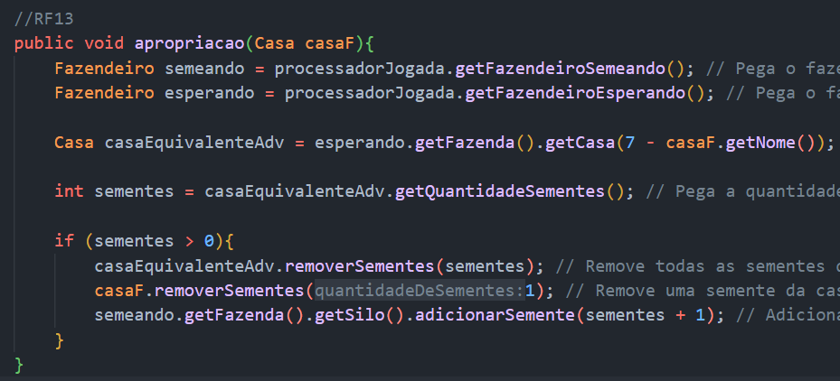

---
author:
- |
  **Caderno de Engenharia**\
  Integrantes:\
  ---------------\
  Gustavo B. Esposar\
  Igor M. Calille\
  Julio Cesar B. Filho\
  Lucas C. P. Graziano\
  Luis Felipe A. B. Matos\
  Pedro A. Krivochein\
  ---------------\
title: "**Projeto Kalah**"
---

::: center
{width="0.7\\linewidth"} []{#fig:capa
label="fig:capa"}
:::

<!-- TOC -->

- [**Projeto Kalah | Caderno de Engenharia**](#projeto-kalah--caderno-de-engenharia)
- [Requisitos](#requisitos)
    - [Modelo de Casos de Uso](#modelo-de-casos-de-uso)
    - [Critérios de Avaliação](#critérios-de-avaliação)
- [Arquitetura](#arquitetura)
    - [Vista de Desenho](#vista-de-desenho)
    - [Vista de Cenários de Uso](#vista-de-cenários-de-uso)
        - [História e Cenários - Semeadura](#história-e-cenários---semeadura)
- [Implementação dos Requisitos Funcionais](#implementação-dos-requisitos-funcionais)
    - [RF-1](#rf-1)
    - [RF-2](#rf-2)
    - [RF-3 e RF-4](#rf-3-e-rf-4)
    - [RF-5](#rf-5)
    - [RF-6](#rf-6)
    - [RF-7](#rf-7)
    - [RF-8](#rf-8)
    - [RF-9](#rf-9)
    - [RF-10 e RF-11](#rf-10-e-rf-11)
    - [RF-12](#rf-12)
    - [RF-13](#rf-13)
    - [RF-14](#rf-14)
    - [RF-15](#rf-15)
    - [RF-16](#rf-16)
    - [RF-17](#rf-17)
    - [RF-18](#rf-18)
    - [RF-19](#rf-19)

<!-- /TOC -->

# Requisitos

O propósito do projeto é desenvolver o código-fonte de um jogo que
implemente o problema do jogo Mancala (variação Kalah). No contexto
apresentado pelo Kalah, têm-se um problema de semeadura num ambiente
rural (**RF-1**) envolvendo dois fazendeiros vizinhos (**RF-2**)
administrando suas próprias fazendas. (**RF-3**) Cada fazenda possui
como estruturas um silo (**RF-4**) e 6 casas que podem ou não conter
sementes. (**RF-5**) No início todas as casas de ambos os fazendeiros
(12 casas) entram no período de semeadura contendo 4 sementes.
(**RF-6**) Um dos fazendeiros é selecionado para iniciar a semeadura na
vizinhança (**RF-7**) revezando entre eles ciclicamente. (**RF-8**)
Durante uma semeadura, o fazendeiro responsável naquele momento escolhe
uma de suas casas contendo sementes (**RF-9**) e distribui
sequencialmente, (**RF-10**) seguindo o sentido anti-horário, uma única
semente em cada casa, podendo ser a casa de seu vizinho se a mesma
estiver no alcance da distribuição (**RF-11**) mas nunca no silo do
vizinho. (**RF-12**) No entanto, se a última semente distribuída pelo
fazendeiro na sua vez de semear cair numa de suas casas e ela estiver
vazia, o mesmo fazendeiro ganha o direito de apropriar-se das sementes
da casa oposta na fazenda de seu vizinho, (**RF-13**) porém, tanto a
última semente quanto as apropriadas são armazenadas no seu silo.
(**RF-14**) Outra possibilidade é a última semente parar no silo do
fazendeiro que está semeando, neste caso, o fazendeiro recebe o direito
de outra semeadura seguida. (**RF-15**) Caso a semente pare numa casa
que possui sementes, nada é feito e a semeadura encerra-se. (**RF-16**)
Quando um dos fazendeiros ficar sem sementes nas casas de sua fazenda, o
período de semeadura é encerrado (**RF-17**) e o fazendeiro vizinho, que
possui sementes, move todas as sementes de suas casas para o armazém.
(**RF-18**) Ao encerrar a semeadura efetua-se a apuração de sementes nos
silos e compara-se entre os fazendeiros, o fazendeiro que tiver mais
sementes ganha o período de semeadura, (**RF-19**) caso contrário ocorre
empate de semeadura entre eles.

## Modelo de Casos de Uso

No modelo de casos de uso mostrado na figura abaixo, temos os casos:
Início de Jogo, Reinício de Jogo, Realização de Jogada, Captura das
Sementes, Destruição de Sementes, Ganho de Turno, Verificação de Empate
e Verificação de Vencedor.

{#fig:casosdeuso
width="0.7\\linewidth"}

## Critérios de Avaliação

O projeto se dá por dois entregáveis mínimos, sendo eles:

> (C13) lista de requisitos (casos de uso, classes conceituais e
> atividades de domínio), descrição arquitetural (módulos contendo
> estruturas de dados e algoritmos) com as justificativas de modelagem,
> (C23) código-fonte em Java e cenários de teste de aceitação.
>
> (C13) Apresentação da vista lógica e entrega da documentação técnica
> na respectiva área do Teams revelando, para cada requisito, se ele foi
> ou não atendido pela vista. Se sim, qual a lógica utilizada e eventual
> trecho de código ilustrativo da realização arquitetural e satisfação
> do requisito. Caso contrário, justifique a impossibilidade de atender
> ao requisito.
>
> (C23) Apresentação da aplicação e entrega da documentação técnica na
> respectiva área do Teams revelando, para cada requisito, se ele foi ou
> não atendido pela arquitetura. Se sim, qual a lógica utilizada e
> eventual trecho de código ilustrativo da realização arquitetural e
> satisfação do requisito. Caso contrário, justifique a impossibilidade
> de atender ao requisito

# Arquitetura

## Vista de Desenho

{#fig:atividades
width="0.9\\linewidth"}

{#fig:domainproblema width="0.9\\linewidth"}

{#fig:domainlogico width="0.9\\linewidth"}

{#fig:domainjava width="1.0\\linewidth"}

## Vista de Cenários de Uso

### História e Cenários - Semeadura

**HISTÓRIA H1:** Semeadura\
**COMO** um Fazendeiro,\
**EU** quero realizar a semeadura de minhas sementes,\
**PARA** dar procedência as demais semeaduras até a colheita final.\
**CENÁRIO H1.C1:** Semeadura comum\
**SABENDO** que o número de sementes em uma casa escolhida n › 0,\
**QUANDO** ocorre a semeadura,\
**ENTÃO** o número de sementes das casas seguintes s = s + 1\
**CENÁRIO H1.C2:** Semeadura com apropriação\
**SABENDO** que o número de sementes em uma casa escolhida n › 0,\
**E** o número de sementes da casa oposta do fazendeiro vizinho m › 0\
**QUANDO** ocorre a semeadura e a última semente é semeada em uma casa
que não possuía sementes,\
**ENTÃO** o número de sementes das casas seguintes s = s + 1, e o número
de sementes do armazém do fazendeiro a = a + \[sementes apropriadas\]\
**CENÁRIO H1.C3:** Semeadura adicional\
**SABENDO** que o número de sementes em uma casa escolhida n › 0,\
**QUANDO** ocorre a semeadura e a última semente é semeada no armazém do
fazendeiro,\
**ENTÃO** o número de sementes das casas seguintes s = s + 1, o número
de sementes no armazém do fazendeiro a = a + 1, o fazendeiro realizará
uma semeadura adicional.\

# Implementação dos Requisitos Funcionais

## RF-1

(**RF-1**) envolvendo dois fazendeiros vizinhos

{#fig:rf-1 width="0.85\\linewidth"}

É implementado através das variáveis de instancia ***f1 e f2***, objetos
da classe ***Fazendeiro***.

## RF-2

(**RF-2**) administrando suas próprias fazendas.

{#fig:rf-2 width="0.7\\linewidth"}

Cada objeto da ***classe Fazendeiro*** possui apenas sua variável de
instância ***fazenda*** do tipo ***Fazenda***.

## RF-3 e RF-4

(**RF-3**) Cada fazenda possui como estruturas um silo (**RF-4**) e 6
casas que podem ou não conter sementes.

{#fig:rf-34
width="0.8\\linewidth"}

Objetos da ***classe Fazenda*** possuem as variáveis de instância
***silo*** e ***casas (lista)***, ambos instanciados no construtor da
classe. Devido ao loop for no construtor, 6 instâncias de ***casa*** são
referenciadas na lista.

## RF-5

(**RF-5**) No início todas as casas de ambos os fazendeiros (12 casas)
entram no período de semeadura contendo 4 sementes.

{#fig:rf-5 width="0.5\\linewidth"}

Cada instância de objetos da ***classe Casa*** atribui 4 sementes à
variável de instância ***sementes*** durante a inicialização pelo
construtor da ***classe Casa***.

## RF-6

(**RF-6**) Um dos fazendeiros é selecionado para iniciar a semeadura na
vizinhança

{#fig:rf-6 width="1.0\\linewidth"}

O método construtor da ***classe ProcessadorDeJogada*** recebe como
primeiro parâmetro a referência de um objeto do tipo ***Fazendeiro***,
atribuindo-o à variável de instância ***fazendeiroSemeando***, já o
segundo fazendeiro à ***fazendeiroEsperando***, alternando ciclicamente
entre eles.

## RF-7

(**RF-7**) revezando entre eles ciclicamente.

{#fig:rf-7 width="0.7\\linewidth"}

É feita uma seleção (*switch case*) da opção em que a última semente do
jogador cai, de acordo com a lógica de semeadura do jogo Kalah. Como
podemos ver, há a opção ***SILO***, em que o jogar joga de novo, a opção
***CASA_VAZIA***, e a opção de quando cai em uma casa comum
***(default)***.

## RF-8

(**RF-8**) Durante uma semeadura, o fazendeiro responsável naquele
momento escolhe uma de suas casas contendo sementes

{#fig:rf-8 width="1.0\\linewidth"}

Este requisito diz respeito ao fazendeiro ativo ter a opção de
selecionar a casa que deseja realizar a ação de semeadura, no código, há
também o controle que proíbe o jogador de escolher uma casa vazia,
localizado na expressão lógica ***casaEscolhida.getQuantidadeSementes()
== 0***.

## RF-9

(**RF-9**) e distribui sequencialmente,

{#fig:rf-9 width="1.0\\linewidth"}

A implementação do processo de semear, que distribui sequencialmente uma
semente para cada casa ou silo seguinte, com exceção do silo do
adversário, ocorre pela execução do método ***semear(casaEscolhida)***.

## RF-10 e RF-11

(**RF-10**) seguindo o sentido anti-horário, uma única semente em cada
casa, podendo ser a casa de seu vizinho se a mesma estiver no alcance da
distribuição (**RF-11**) mas nunca no silo do vizinho.

{#fig:rf-1011-1
width="1.0\\linewidth"}

{#fig:rf-1011-2
width="1.0\\linewidth"}

A implementação da distribuição de sementes no sentido anti-horário
encontra-se no loop while, que também apresenta o controle de não
distribuir uma semente no caso da próxima ação de semear ocorrer no
silo do adversário.

## RF-12

(**RF-12**) No entanto, se a última semente distribuída pelo fazendeiro
na sua vez de semear cair numa de suas casas e ela estiver vazia, o
mesmo fazendeiro ganha o direito de apropriar-se das sementes da casa
oposta na fazenda de seu vizinho,

{#fig:rf-12 width="0.65\\linewidth"}

É implementado através da instrução ***case CASA_VAZIA*** dentro do
switch case.

## RF-13

(**RF-13**) porém, tanto a última semente quanto as apropriadas são
armazenadas no seu silo.

{#fig:rf-13
width="1.0\\linewidth"}

É implementado por meio do método ***apropriação*** que tem como
argumento a casa relativa a ultima semente. Nele, pegamos os dois
fazendeiros ('semeando' e 'esperando'), buscamos a casa oposta referente
ao argumento da função, pegamos a quantidade de sementes dela e contiver
sementes, fazemos a apropriação das mesmas para o fazendeiro que semear.

## RF-14

(**RF-14**) Outra possibilidade é a última semente parar no silo do
fazendeiro que está semeando, neste caso, o fazendeiro recebe o direito
de outra semeadura seguida.

{#fig:rf-14 width="0.4\\linewidth"}

É implementado através da instrução ***case SILO***, fazendo com que o
fazendeiro que está semeando tenha a possibilidade de outra semeadura.

## RF-15

(**RF-15**) Caso a semente pare numa casa que possui sementes, nada é
feito e a semeadura encerra-se.

{#fig:rf-15 width="0.8\\linewidth"}

É implementado através da instrução ***default***, alternando a
permissão para semear entre os fazendeiros.

## RF-16

(**RF-16**) Quando um dos fazendeiros ficar sem sementes nas casas de
sua fazenda, o período de semeadura é encerrado

{#fig:rf-16 width="1.0\\linewidth"}

É implementado através da condição de parada do while block
***f1.temSementes() && f2.temSementes()***, fazendo com que o tempo de
semeadura dos fazendeiros só acabe enquanto um dos dois não tiver
semente nas casas.

## RF-17

(**RF-17**) e o fazendeiro vizinho, que possui sementes, move todas as
sementes de suas casas para o armazém.

{#fig:rf-17 width="0.8\\linewidth"}

É implementado através do método ***transferirSementesSilo()***
referentes a cada fazendeiro, fazendo com que todas as sementes das
casas de cada fazendeiro sejam movidas ao silo.

## RF-18

(**RF-18**) Ao encerrar a semeadura efetua-se a apuração de sementes nos
silos e compara-se entre os fazendeiros, o fazendeiro que tiver mais
sementes ganha o período de semeadura,

{#fig:rf-18 width="1.0\\linewidth"}

É implementado através da condição de checagem de quantidades de
sementes nos silos respectivos aos dois fazendeiros, fazendo com que
quem tiver o maior número ganhe.

## RF-19

(**RF-19**) caso contrário ocorre empate de semeadura entre eles.

{#fig:rf-19 width="1.0\\linewidth"}

É implementado através do método ***definirVencedor()*** com o argumento
3 (que exemplifica a 'flag' de empate).
